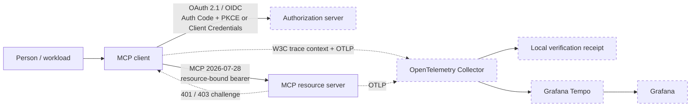

# mcp-client-auth-template

[](https://github.com/brunovicco/mcp-client-auth-template/actions/workflows/quality.yml)
[](https://github.com/brunovicco/mcp-client-auth-template/actions/workflows/reference-demos.yml)
[](https://github.com/brunovicco/mcp-client-auth-template/releases)

[](LICENSE)

*[Leia em português](README.pt-BR.md)*

> A production-oriented authentication reference for remote MCP clients: OAuth 2.1/OIDC,
> Authorization Code + PKCE, Client Credentials, CIMD-first discovery, bounded scope step-up,
> exact resource binding, stateless MCP `2026-07-28`, and end-to-end OpenTelemetry evidence.

Use this repository when the hard part is not "how do I call an MCP server?" but **how do I do it
without weakening identity, token, transport, and observability boundaries**. It pairs with
[`mcp-server-auth-template`](https://github.com/brunovicco/mcp-server-auth-template) and includes
executable reference demos that require no production credentials or real identity provider.

## What this repository proves

The executable reference path validates real behavior rather than relying on configuration claims:

- ✅ CIMD-first interactive OAuth with Authorization Code + PKCE
- ✅ RFC 9728 Protected Resource Metadata and RFC 8707 resource binding
- ✅ RFC 9207 authorization-response issuer validation
- ✅ bounded `403 insufficient_scope` step-up without widening grants silently
- ✅ protected tools hidden from anonymous catalog discovery
- ✅ wrong-audience JWT rejected with `401`
- ✅ stateless MCP `2026-07-28` transport with no `Mcp-Session-Id` state
- ✅ optional Client Credentials profile for unattended generic-OIDC workloads
- ✅ W3C trace-context propagation across MCP client and server
- ✅ the same distributed trace positively verified in Collector and Tempo
- ✅ telemetry checks that exclude OAuth/MCP sensitive values

## Architecture



The local reference environment uses a synthetic OIDC server plus local observability services.
The production client boundary remains provider-agnostic: Microsoft Entra ID or a
standards-compliant generic OIDC authorization server can own token issuance.

For the detailed authorization sequence and component responsibilities, see
[Architecture](docs/ARCHITECTURE.md).

## 5-minute demo

The fastest path to evaluate the project is the containerized reference scenario:

```bash
./scripts/run_compose_demo.sh
```

It runs the client against the published companion Server `v0.5.0` by immutable digest, performs
CIMD-first Authorization Code + PKCE, proves scope step-up and negative audience handling, and
finishes with a deterministic pass/fail banner.

For the full observable proof:

```bash
./scripts/run_observability_demo.sh --keep
```

A successful run ends with:

```text
P1.7c OBSERVABILITY DEMO PASSED
Collector: positive OTLP receipt
Context:   MCP client/server share one trace_id
Tempo:     trace query succeeded
Grafana:   Tempo datasource provisioned
Privacy:   OAuth/MCP sensitive values absent
```

### Visual proof


The observable run produces a real distributed trace containing the reference-flow root plus client
and server MCP spans:


## Reference demos

| Demo | Command | What it proves |
| --- | --- | --- |
| P1.7a — headless | `./scripts/run_reference_demo.sh` | Real sibling server + synthetic OIDC, interactive OAuth, step-up, wrong audience, stateless MCP |
| P1.7b — Compose | `./scripts/run_compose_demo.sh` | Reproducible container topology using the published Server image by immutable digest |
| P1.7c — observable | `./scripts/run_observability_demo.sh` | Collector receipt, client/server trace continuity, Tempo retrieval, Grafana provisioning, privacy assertions |

P1.7a accepts `--server-root PATH` when the companion repository is not cloned beside this one.

## Demo vs production

| Reference demo | Production adoption |
| --- | --- |
| Synthetic local OIDC | Enterprise IdP / authorization server with reviewed registration and consent policy |
| Loopback-only shared container namespace | TLS-protected service networking and explicit proxy ownership |
| Local OpenTelemetry Collector | Organization-managed telemetry pipeline |
| Local Tempo with short demo flush/poll intervals | Retention, batching, HA and storage settings sized for production |
| Anonymous local Grafana | Authenticated Grafana with least-privilege access |
| Synthetic identities and keys | Secret-manager-backed credentials and provider-specific operational controls |

The local settings are deliberately optimized for a deterministic proof, not copied as production
defaults.

## Authentication modes

| Mode | Providers | Credential lifecycle | Typical fit |
| --- | --- | --- | --- |
| `interactive` | Entra ID or generic OIDC | Browser + PKCE; optional refreshable token file | Developer tools, desktop/native apps, operator CLIs |
| `client_credentials` | Generic OIDC deterministic profile | Secret injected at startup; access tokens stay in memory | CI jobs, backend workers, scheduled automation |

Interactive generic OIDC uses CIMD first with DCR only as a compatibility fallback. Entra uses a
pre-registered client. Machine mode does not open a browser, start the loopback callback, use
CIMD/DCR, or persist its credential/access token.

## Security properties

- OAuth discovery and token traffic are HTTPS by default and pass through scheme, redirect,
  compression, response-size, destination, DNS-answer, and rebinding controls.
- Bearer credentials are sent only to the exact configured MCP resource boundary.
- The loopback callback accepts literal loopback addresses, bounded requests, exact paths, and
  validated OAuth state/issuer data.
- POSIX token files require private ownership and permissions, reject symlinks/hardlinks, cap read
  size, and use durable atomic replacement. In-memory storage is available.
- Client secrets use `SecretStr`, remain in memory, and are excluded from structured failures.
- Traces and logs exclude credentials, authorization codes, MCP payloads, bodies, arbitrary
  headers/URLs, baggage, personal data, and exception text.
- GitHub Actions are SHA-pinned with read-only permissions by default; release writes are isolated
  into narrowly scoped jobs.

Persistent interactive token storage is intentionally plaintext. Filesystem controls reduce local
exposure but do not replace an OS keyring or secrets manager. Read
[Privacy and data handling](docs/PRIVACY.md) before choosing a production storage adapter.

## MCP `2026-07-28`

The paired client/server templates exercise the modern stateless profile as executable behavior:

- `server/discover` selects the modern protocol path without the legacy
  `initialize` / `initialized` handshake;
- per-request `_meta` carries client identity/capabilities;
- modern requests use `MCP-Protocol-Version`, `Mcp-Method`, and `Mcp-Name`;
- Protected Resource Metadata drives authorization-server discovery;
- `resource` flows through authorization/token requests and binds the JWT audience;
- runtime `403 insufficient_scope` preserves existing grants and performs one bounded replay;
- machine-to-machine access is opt-in through
  `io.modelcontextprotocol/oauth-client-credentials`.

See [Compatibility](docs/COMPATIBILITY.md) and [Cross-repository E2E](docs/E2E.md).

For an evidence-first mapping of the paired client/server implementation against the MCP
`2026-07-28` authorization profile, see the companion
[Authorization Implementer Report](https://github.com/brunovicco/mcp-server-auth-template/blob/main/docs/AUTHORIZATION_IMPLEMENTER_REPORT.md).
The report distinguishes pair E2E evidence, project-owned behavior, SDK-delegated behavior,
and requirements that are not independently exercised.

## Quick start

Prerequisites: Python 3.13 or 3.14 and
[`uv`](https://docs.astral.sh/uv/getting-started/installation/).

```bash
git clone https://github.com/brunovicco/mcp-client-auth-template.git
cd mcp-client-auth-template
cp .env.example .env
uv sync --frozen --all-groups
uv run python -m mcp_client_auth_template.entrypoints.demo_client
```

Point `MCP_CLIENT_SERVER_URL` at your MCP resource server and configure either the Entra or
generic-OIDC block in `.env`.

## Repository structure

```text
src/                    client implementation
tests/                  unit, contract and E2E evidence
scripts/                quality, demo and release automation
docs/                   architecture, operations and security
observability/          Collector, Tempo and Grafana demo configuration
.github/workflows/      CI, compatibility, demo and release workflows
compose.reference-demo.yml
compose.observability.yml
```

Local editor/agent state is intentionally excluded from the public repository.

## Testing and quality

```bash
uv lock --check
uv sync --frozen --all-groups
uv run pytest
uv run python scripts/quality_gate.py
```

The quality gate covers lint, format, strict Mypy, architecture, tests/coverage, Bandit,
dependency audit, supply-chain controls, governance baseline, and vendored loop-schema validation.

Reference demos have their own GitHub Actions workflow. P1.7a and P1.7b run on pull requests;
P1.7c runs on `main`, scheduled validation, and manual dispatch.

## Documentation

| Document | Use it for |
| --- | --- |
| [Architecture](docs/ARCHITECTURE.md) | Boundaries, layers and authorization sequence |
| [Compatibility](docs/COMPATIBILITY.md) | Supported versions and executable client/server contract |
| [Reference demo](docs/REFERENCE_DEMO.md) | P1.7a headless proof |
| [Compose demo](docs/COMPOSE_DEMO.md) | P1.7b containerized proof |
| [Observable demo](docs/OBSERVABILITY_DEMO.md) | P1.7c Collector/Tempo/Grafana proof |
| [Cross-repository E2E](docs/E2E.md) | Positive and fail-closed OAuth/MCP matrix |
| [Operations](docs/OPERATIONS.md) | Preflight, timeouts, shutdown and failure categories |
| [Privacy](docs/PRIVACY.md) | Token inventory, storage, retention and data handling |
| [Supply chain](docs/SUPPLY_CHAIN.md) | CI trust boundary, dependency policy and release evidence |
| [Development](docs/DEVELOPMENT.md) | Local setup, checks and container workflow |
| [Architecture decisions](docs/adr/) | Rationale and trade-offs behind material decisions |

## Companion server

The intended reference pair is:

- client: [`brunovicco/mcp-client-auth-template`](https://github.com/brunovicco/mcp-client-auth-template)
- server: [`brunovicco/mcp-server-auth-template`](https://github.com/brunovicco/mcp-server-auth-template)

The demos use synthetic local identity material only; normal CI requires no production secret or
real IdP.

## Scope

This repository is a reference template, not a hosted OAuth client. A concrete product must still
choose redirect registration, consent policy, secure secret delivery, production token storage,
TLS/proxy ownership, user-facing error handling, monitoring ownership, and live IdP validation.

## License

[MIT](LICENSE)
