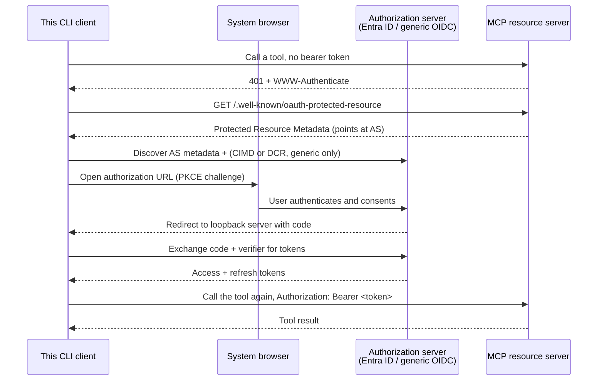

# mcp-client-auth-template

[](https://github.com/brunovicco/mcp-client-auth-template/actions/workflows/quality.yml)
[](https://github.com/brunovicco/mcp-client-auth-template/actions/workflows/compatibility.yml)
[](https://github.com/brunovicco/mcp-client-auth-template/actions/workflows/e2e.yml)
[](https://github.com/brunovicco/mcp-client-auth-template/releases)

[](LICENSE)

*[Leia em português](README.pt-BR.md)*

A reusable template for a native/CLI MCP client that authenticates against an OAuth 2.1
authorization server - Microsoft Entra ID or any standards-compliant OIDC authorization server
(Auth0, Keycloak, WorkOS AuthKit, ...) - and then calls tools on an MCP resource server.
Targets the MCP **2026-07-28** specification. This is the client-side half of the pattern in
[`mcp-server-auth-template`](https://github.com/brunovicco/mcp-server-auth-template); the two
are meant to be run against each other, and each stands on its own as a starting point too.

The official MCP Python SDK's `OAuthClientProvider` handles Protected Resource Metadata and
authorization-server discovery, PKCE, token refresh, RFC 9207 issuer validation, issuer-bound
client credentials, Client ID Metadata Documents when advertised, and Dynamic Client Registration
fallback where supported. MCP `2026-07-28` deprecates DCR in favor of Client ID Metadata Documents
for new integrations. Entra mode therefore uses a pre-registered public client. This template
supplies the embedding pieces the SDK asks for - token storage, opening a browser, receiving the
redirect, and the Entra pre-registration adapter - without re-deriving those security boundaries
in every client. See `docs/adr/0002-oauth21-native-client.md` for the full reasoning.

## Compatibility

Release `v0.2.0` supports Python **3.13 and 3.14**, MCP Python SDK **2.x**
(`>=2.0,<3`), and the MCP **2026-07-28** reference profile. CI continuously exercises the SDK
support floor (`2.0.0`) and the latest compatible 2.x, both auth providers, production HTTPS,
explicit IPv4/IPv6 loopback development profiles, and a real OAuth/MCP E2E flow against the
companion server.

See [`docs/COMPATIBILITY.md`](docs/COMPATIBILITY.md) for the executable support policy and its
scope. Provider-specific live IdP interoperability is intentionally not claimed by the local
deterministic matrix.

## Auth quick start

1. Copy `.env.example` to `.env` and fill in one of the two provider blocks (Entra ID or a
   generic OIDC authorization server), and point `MCP_CLIENT_SERVER_URL` at a running instance
   of the server template.
2. Run the demo:

   ```bash
   uv run python -m mcp_client_auth_template.entrypoints.demo_client
   ```
3. The first run opens your browser for the authorization code + PKCE flow, waits on a local
   loopback listener (`http://127.0.0.1:8765/callback` by default) for the redirect, exchanges
   the code for tokens, and calls the server's `whoami` and `health` tools.
4. With `MCP_CLIENT_TOKEN_STORAGE_PATH` set (the default,
   `~/.mcp-client-auth-template/tokens.json`), later runs reuse and silently refresh the stored
   token instead of prompting again. Unset it to fall back to in-memory-only storage.

Swap `MCP_CLIENT_AUTH_PROVIDER` between `entra` and `generic` to switch adapters - no other code
changes. See `src/mcp_client_auth_template/adapters/` for the two provider factories and
`tests/unit/test_*_client_auth.py` for how each is tested offline (a fake in-memory token
store, no network, no real IdP needed).

## Auth flow

The full authorization-code + PKCE exchange this client drives, end to end:



See `docs/ARCHITECTURE.md` for the full layer breakdown and cross-cutting decisions behind it.

## Development

```bash
uv lock --check
uv sync --frozen --all-groups
uv run pytest
uv run python scripts/quality_gate.py
```

List or select gate checks with `--list` and `--check NAME`. See `AGENTS.md` for build, lint,
format, typecheck, test, security, architecture, MCP, and completion requirements, and
`docs/DEVELOPMENT.md` for the container build and local setup.

Codex loads the checked-in `.codex/config.toml`, `.codex/hooks.json`, and `.agents/skills/` only
within the appropriate project/trust context. Review lifecycle hooks with `/hooks` before use.

## License

[MIT](LICENSE)
