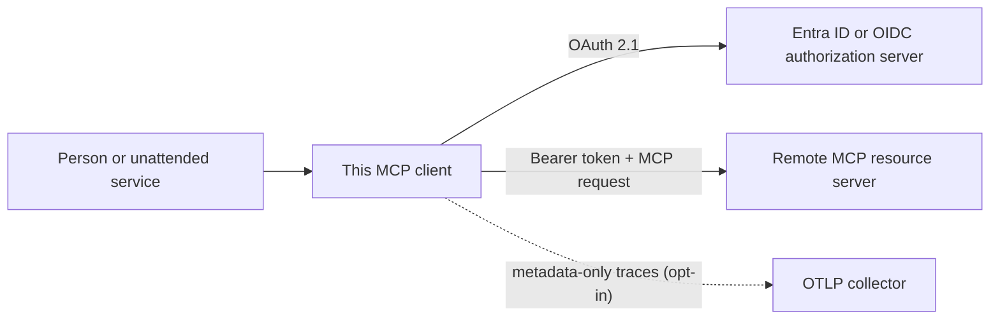

# mcp-client-auth-template

[](https://github.com/brunovicco/mcp-client-auth-template/actions/workflows/quality.yml)
[](https://github.com/brunovicco/mcp-client-auth-template/actions/workflows/compatibility.yml)
[](https://github.com/brunovicco/mcp-client-auth-template/actions/workflows/e2e.yml)
[](https://github.com/brunovicco/mcp-client-auth-template/releases)

[](LICENSE)

*[Leia em português](README.pt-BR.md)*

> A production-minded OAuth 2.1 client template for remote MCP: interactive Authorization Code +
> PKCE, non-interactive Client Credentials, hardened token boundaries, and real interoperability
> evidence against a companion server.

Use it to build a native/CLI or service MCP client without reimplementing browser handoff,
loopback callbacks, token storage, authorization-server discovery, progressive authorization, and
safe HTTP transport. It targets the MCP **2026-07-28** reference profile and pairs with
[`mcp-server-auth-template`](https://github.com/brunovicco/mcp-server-auth-template).

## Why this template

- **Use the official SDK where it matters.** OAuth discovery, PKCE, token refresh, resource
  indicators, protocol negotiation, and scope recovery stay on public MCP SDK boundaries.
- **Cover people and workloads.** Run interactively with Entra ID or generic OIDC, or use a
  pre-registered generic-OIDC confidential client for unattended jobs.
- **Keep credentials inside explicit boundaries.** Hardened discovery, DNS pinning, exact bearer
  destinations, bounded loopback callbacks, and defensive token-file handling fail closed.
- **Evaluate behavior, not promises.** A dedicated workflow runs the real client against the real
  companion server through positive and negative OAuth/MCP scenarios.

## Who it is for

| Audience | What they can evaluate or reuse |
| --- | --- |
| Developers | A runnable OAuth/MCP client, provider adapters, secure storage boundary, and headless E2E harness |
| Tech leads and CTOs | Identity-flow ownership, data handling, failure behavior, compatibility policy, and rollout assumptions |
| Engineering reviewers | Concrete evidence of protocol integration, secure coding, strict typing, testing depth, and architectural judgment |

## At a glance

| Dimension | Included contract |
| --- | --- |
| MCP | Python SDK `>=2.0,<3`, protocol profile `2026-07-28`, Streamable HTTP |
| Interactive auth | Authorization Code + PKCE, RFC 8252 loopback callback, RFC 9207 issuer validation |
| Machine auth | Draft MCP OAuth Client Credentials extension with `client_secret_basic` for generic OIDC |
| Identity providers | Microsoft Entra ID or standards-compliant generic OIDC |
| Network security | HTTPS by default, SSRF controls, DNS pinning, redirect policy, exact bearer-token destination |
| Token handling | Hardened optional POSIX file storage for interactive mode; memory-only machine credentials/tokens |
| Observability | Structured logs and opt-in metadata-only W3C tracing through `a2a-otel-kit` and native HTTPX2 |
| Evidence | Locked quality gate, compatibility matrices, canonical pair contract, and 12-scenario E2E suite |

## Where it fits



The authorization server owns authentication and token issuance. The remote MCP server owns token
validation and tool authorization. This client owns the embedding concerns between them: secure
discovery, user/browser integration, callback handling, token lifecycle, transport policy, and MCP
client orchestration.

## Quick start

Prerequisites: Python 3.13 or 3.14,
[`uv`](https://docs.astral.sh/uv/getting-started/installation/), and a running MCP resource server.

```bash
git clone https://github.com/brunovicco/mcp-client-auth-template.git
cd mcp-client-auth-template
cp .env.example .env
uv sync --frozen --all-groups
uv run python -m mcp_client_auth_template.entrypoints.demo_client
```

Point `MCP_CLIENT_SERVER_URL` at the MCP server and configure either the Entra or generic-OIDC
block in `.env`. In the default interactive mode, the first run opens the system browser, waits for
the loopback redirect, exchanges the code with PKCE, and calls `whoami` and `health`. Later runs can
reuse and refresh the stored token.

For the complete local pair, clone
[`mcp-server-auth-template`](https://github.com/brunovicco/mcp-server-auth-template) beside this
repository and follow [Cross-repository E2E](docs/E2E.md).

## Authentication modes

| Mode | Providers | Credential lifecycle | Good fit |
| --- | --- | --- | --- |
| `interactive` | Entra ID or generic OIDC | Browser + PKCE; optional refreshable token file | Developer tools, desktop/native apps, operator CLIs |
| `client_credentials` | Generic OIDC deterministic profile | Secret injected at startup; access tokens remain in memory | CI jobs, backend workers, scheduled automation |

Switch providers with `MCP_CLIENT_AUTH_PROVIDER=entra` or `generic`; switch modes with
`MCP_CLIENT_AUTH_MODE=interactive` or `client_credentials`.

For unattended jobs, pre-register the confidential client, configure
`MCP_CLIENT_CLIENT_CREDENTIALS_CLIENT_ID`, and inject
`MCP_CLIENT_CLIENT_CREDENTIALS_SECRET` from a secret manager. Machine mode does not open a browser,
start a callback listener, use CIMD/DCR, or write its credential or access token to persistent
storage.

## What the flow proves

The companion E2E exercises the actual client and server with a deterministic local OIDC provider:

```text
MCP 401 challenge -> Protected Resource Metadata -> OIDC discovery
-> CIMD-first public client or backwards-compatible DCR
-> authorization code + PKCE + RFC 9207 issuer validation
-> resource-bound token -> authenticated MCP tool call
-> pre-dispatch 403 scope challenge -> one elevated replay -> success
```

The machine profile separately proves extension advertisement, `client_secret_basic`,
resource-bound token acquisition, machine identity, and progressive scopes without a browser or
persistent token. The negative matrix covers wrong issuer/audience, expiry, insufficient scope,
invalid machine credentials, envelope mismatches, unsupported protocol versions, and authorization
response issuer mismatch.

## Security posture

- OAuth discovery and token traffic are HTTPS by default and pass through scheme, redirect,
  compression, response-size, destination, DNS-answer, and rebinding controls.
- Bearer credentials are sent only to the exact configured MCP resource boundary.
- The loopback callback accepts literal loopback addresses, bounded requests, exact paths, and
  validated OAuth response state/issuer data.
- POSIX token files require private ownership and permissions, reject symlinks/hardlinks, cap read
  size, and use durable atomic replacement. In-memory storage is available.
- Client secrets use `SecretStr`, stay in memory, and are excluded from structured failures.
- Logs and traces exclude credentials, authorization codes, MCP payloads, bodies, arbitrary
  headers/URLs, personal data, baggage, and exception text.

Persistent token storage is intentionally plaintext. Filesystem controls reduce local exposure but
do not replace an OS keyring or secrets manager. Read [Privacy and data handling](docs/PRIVACY.md)
before choosing a storage adapter.

## Engineering evidence

- deterministic quality gate covering lint, format, strict Mypy, architecture, tests, coverage,
  Bandit, dependency audit, and an executable supply-chain trust baseline;
- SHA-pinned GitHub Actions, read-only workflow permissions, weekly controlled updates, and
  pull-request dependency/license review;
- CycloneDX source/runtime inventories plus checksum-verified image vulnerability evidence and a
  fail-closed, time-bounded exception gate;
- allowlisted, byte-reproducible Python release artifacts with SHA-256 manifests and GitHub build
  provenance attestations;
- Python 3.13/3.14 against MCP SDK 2.0.0 and the latest compatible 2.x;
- Entra/generic OIDC across production HTTPS and explicit IPv4/IPv6 loopback profiles;
- real 12-scenario OAuth/MCP E2E against the companion server, including fail-closed cases;
- synthetic local identities and keys only: normal CI never needs a real IdP or production secret;
- ADRs record security, protocol, storage, operations, compatibility, and observability trade-offs.

## Observability

`a2a-otel-kit` wraps the native MCP SDK 2.x HTTPX2 transport and injects W3C trace context without
reading request or response bodies. Export is network-silent unless explicitly enabled with
`A2A_OTEL_ENABLED=true` and a complete OTLP traces endpoint. See
[Observability policy](docs/OBSERVABILITY.md).

## Documentation map

| Document | Use it for |
| --- | --- |
| [Architecture](docs/ARCHITECTURE.md) | Context, layers, ownership boundaries, and authorization sequence |
| [Compatibility](docs/COMPATIBILITY.md) | Supported versions and executable client/server contract |
| [Cross-repository E2E](docs/E2E.md) | Happy paths, fail-closed matrix, and local execution |
| [Operations](docs/OPERATIONS.md) | Preflight, timeouts, shutdown, failure categories, and containers |
| [Privacy](docs/PRIVACY.md) | Token inventory, storage controls, retention, and external processors |
| [Supply chain](docs/SUPPLY_CHAIN.md) | Dependency policy, CI trust boundary, threats, and exceptions |
| [Observability](docs/OBSERVABILITY.md) | OpenTelemetry configuration and content-exclusion policy |
| [Development](docs/DEVELOPMENT.md) | Local environment, checks, and container workflow |
| [Architecture decisions](docs/adr/) | Rationale and trade-offs behind material decisions |

## Development

```bash
uv lock --check
uv sync --frozen --all-groups
uv run pytest
uv run python scripts/quality_gate.py
```

The quality gate is the definition of done. Use `--list` or `--check NAME` for focused local
feedback, then run the complete gate before opening a pull request.

## Scope and production adoption

This repository is a reference template, not a hosted OAuth client. A concrete product must still
choose redirect registration, consent policy, secure secret delivery, a production token-storage
adapter, TLS/proxy ownership, user-facing error rendering, monitoring ownership, and live IdP
validation. The deterministic pair does not claim Entra client-credentials interoperability;
Entra's `{resource}/.default` and application-role model require provider-specific validation.

## License

[MIT](LICENSE)
