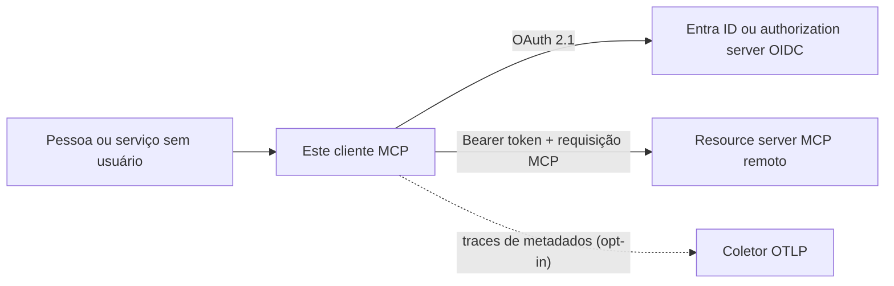

# mcp-client-auth-template

[](https://github.com/brunovicco/mcp-client-auth-template/actions/workflows/quality.yml)
[](https://github.com/brunovicco/mcp-client-auth-template/actions/workflows/compatibility.yml)
[](https://github.com/brunovicco/mcp-client-auth-template/actions/workflows/e2e.yml)
[](https://github.com/brunovicco/mcp-client-auth-template/releases)

[](LICENSE)

*[Read in English](README.md)*

> Um template de cliente OAuth 2.1 para MCP remoto, pensado para produção: Authorization Code +
> PKCE interativo, Client Credentials sem usuário, fronteiras de token endurecidas e evidência real
> de interoperabilidade contra um servidor companheiro.

Use este projeto para criar um cliente MCP nativo/CLI ou de serviço sem reimplementar integração
com browser, callback loopback, armazenamento de tokens, discovery do authorization server,
autorização progressiva e transporte HTTP seguro. O alvo é o perfil de referência MCP
**2026-07-28**, em conjunto com o
[`mcp-server-auth-template`](https://github.com/brunovicco/mcp-server-auth-template).

## Por que este template existe

- **Use o SDK oficial nas fronteiras certas.** Discovery OAuth, PKCE, refresh de token, resource
  indicators, negociação de protocolo e recuperação de scopes permanecem em APIs públicas do SDK.
- **Atenda pessoas e workloads.** Rode de forma interativa com Entra ID ou OIDC genérico, ou use um
  cliente confidencial OIDC genérico pré-registrado para jobs sem usuário.
- **Mantenha credenciais dentro de limites explícitos.** Discovery endurecido, DNS pinning, destino
  exato do bearer, callbacks loopback limitados e arquivo de tokens defensivo falham de forma segura.
- **Avalie comportamento, não promessas.** Um workflow dedicado executa o cliente real contra o
  servidor real em cenários OAuth/MCP positivos e negativos.

## Para quem é

| Público | O que pode avaliar ou reutilizar |
| --- | --- |
| Desenvolvedores | Um cliente OAuth/MCP executável, adapters de provider, storage seguro e harness E2E headless |
| Tech leads e CTOs | Ownership dos fluxos de identidade, dados, falhas, compatibilidade e rollout |
| Revisores técnicos | Evidências concretas de integração de protocolos, segurança, tipagem estrita, profundidade de testes e julgamento arquitetural |

## Visão rápida

| Dimensão | Contrato incluído |
| --- | --- |
| MCP | Python SDK `>=2.0,<3`, perfil `2026-07-28`, Streamable HTTP |
| Auth interativa | Authorization Code + PKCE, callback loopback RFC 8252 e validação de issuer RFC 9207 |
| Auth de máquina | Extensão draft MCP OAuth Client Credentials com `client_secret_basic` para OIDC genérico |
| Providers | Microsoft Entra ID ou OIDC genérico compatível com padrões |
| Segurança de rede | HTTPS por padrão, controles SSRF, DNS pinning, política de redirect e destino exato do bearer |
| Tokens | Arquivo POSIX endurecido e opcional no modo interativo; credenciais/tokens de máquina em memória |
| Observabilidade | Logs estruturados e tracing W3C apenas de metadados via `a2a-otel-kit` e HTTPX2 nativo |
| Evidências | Quality gate travado, matrizes de compatibilidade, contrato do par e suíte E2E de 12 cenários |

## Onde ele se encaixa



O authorization server controla autenticação e emissão de tokens. O servidor MCP remoto controla
validação do token e autorização das tools. Este cliente controla as responsabilidades de
integração entre os dois: discovery seguro, browser, callback, ciclo de vida do token, política de
transporte e orquestração do cliente MCP.

## Início rápido

Pré-requisitos: Python 3.13 ou 3.14,
[`uv`](https://docs.astral.sh/uv/getting-started/installation/) e um resource server MCP em execução.

```bash
git clone https://github.com/brunovicco/mcp-client-auth-template.git
cd mcp-client-auth-template
cp .env.example .env
uv sync --frozen --all-groups
uv run python -m mcp_client_auth_template.entrypoints.demo_client
```

Aponte `MCP_CLIENT_SERVER_URL` para o servidor MCP e configure o bloco do Entra ou do OIDC genérico
no `.env`. No modo interativo padrão, a primeira execução abre o browser, aguarda o redirect
loopback, troca o code com PKCE e chama `whoami` e `health`. Execuções seguintes podem reutilizar e
renovar o token armazenado.

Para rodar o par local completo, clone o
[`mcp-server-auth-template`](https://github.com/brunovicco/mcp-server-auth-template) ao lado deste
repositório e siga o [E2E entre repositórios](docs/E2E.md).

## Modos de autenticação

| Modo | Providers | Ciclo de vida da credencial | Uso indicado |
| --- | --- | --- | --- |
| `interactive` | Entra ID ou OIDC genérico | Browser + PKCE; arquivo opcional de token renovável | Ferramentas de desenvolvimento, apps nativos/desktop e CLIs de operador |
| `client_credentials` | Perfil determinístico OIDC genérico | Secret injetado no startup; access tokens ficam em memória | CI, workers de backend e automações agendadas |

Troque o provider com `MCP_CLIENT_AUTH_PROVIDER=entra` ou `generic`; troque o modo com
`MCP_CLIENT_AUTH_MODE=interactive` ou `client_credentials`.

Para jobs sem usuário, pré-registre o cliente confidencial, configure
`MCP_CLIENT_CLIENT_CREDENTIALS_CLIENT_ID` e injete
`MCP_CLIENT_CLIENT_CREDENTIALS_SECRET` por um secret manager. O modo máquina não abre browser,
inicia callback, usa CIMD/DCR nem grava sua credencial ou access token em storage persistente.

## O que o fluxo prova

O E2E do par exercita cliente e servidor reais com um provider OIDC local e determinístico:

```text
Desafio MCP 401 -> Protected Resource Metadata -> OIDC discovery
-> cliente público CIMD-first ou DCR retrocompatível
-> authorization code + PKCE + validação de issuer RFC 9207
-> token vinculado ao recurso -> chamada MCP autenticada
-> desafio 403 de scope antes do dispatch -> um replay elevado -> sucesso
```

O perfil máquina prova separadamente anúncio da extensão, `client_secret_basic`, aquisição de token
vinculado ao recurso, identidade de máquina e scopes progressivos sem browser ou token persistente.
A matriz negativa cobre issuer/audience incorretos, expiração, scope insuficiente, credencial de
máquina inválida, divergência de envelope, versão de protocolo não suportada e issuer incorreto na
resposta de autorização.

## Postura de segurança

- Discovery OAuth e tráfego de tokens usam HTTPS por padrão e passam por controles de esquema,
  redirect, compressão, tamanho de resposta, destino, respostas DNS e rebinding.
- Credenciais bearer são enviadas apenas para a fronteira exata do recurso MCP configurado.
- O callback loopback aceita endereços loopback literais, requisições limitadas, path exato e dados de
  state/issuer OAuth validados.
- Arquivos de token POSIX exigem ownership/permissões privadas, rejeitam symlinks/hardlinks, limitam
  o tamanho de leitura e usam substituição atômica durável. Storage em memória também está disponível.
- Client secrets usam `SecretStr`, ficam em memória e não aparecem em falhas estruturadas.
- Logs e traces excluem credenciais, authorization codes, payloads MCP, bodies, headers/URLs
  arbitrários, dados pessoais, baggage e texto de exceções.

O armazenamento persistente de tokens é intencionalmente plaintext. Controles do sistema de arquivos
reduzem a exposição local, mas não substituem um keyring do sistema operacional ou secrets manager.
Leia [Privacidade e tratamento de dados](docs/PRIVACY.md) antes de escolher um adapter de storage.

## Evidências de engenharia

- quality gate determinístico com lint, format, Mypy estrito, arquitetura, testes, cobertura,
  Bandit, auditoria de dependências e baseline executável de confiança da supply chain;
- GitHub Actions fixadas por SHA, permissões read-only, updates semanais controlados e revisão de
  dependências/licenças nos pull requests;
- inventários CycloneDX de código/runtime, evidência de vulnerabilidades da imagem com checksum e
  gate fail-closed para exceções temporárias;
- Python 3.13/3.14 contra MCP SDK 2.0.0 e a versão 2.x compatível mais recente;
- Entra/OIDC genérico em HTTPS de produção e perfis locais IPv4/IPv6 explicitamente habilitados;
- E2E OAuth/MCP real de 12 cenários contra o servidor companheiro, incluindo casos fail-closed;
- apenas identidades e chaves locais sintéticas: o CI normal não precisa de IdP real ou secret de
  produção;
- ADRs registram trade-offs de segurança, protocolo, storage, operações, compatibilidade e
  observabilidade.

## Observabilidade

O `a2a-otel-kit` envolve o transporte HTTPX2 nativo do MCP SDK 2.x e injeta contexto W3C sem ler
bodies de request ou response. O export é silencioso em rede, a menos que
`A2A_OTEL_ENABLED=true` e um endpoint OTLP completo de traces sejam configurados. Veja a
[política de observabilidade](docs/OBSERVABILITY.md).

## Mapa da documentação

| Documento | Quando usar |
| --- | --- |
| [Arquitetura](docs/ARCHITECTURE.md) | Contexto, camadas, ownership e sequência de autorização |
| [Compatibilidade](docs/COMPATIBILITY.md) | Versões suportadas e contrato executável cliente/servidor |
| [E2E entre repositórios](docs/E2E.md) | Happy paths, matriz fail-closed e execução local |
| [Operações](docs/OPERATIONS.md) | Preflight, timeouts, shutdown, categorias de falha e containers |
| [Privacidade](docs/PRIVACY.md) | Inventário de tokens, storage, retenção e processadores externos |
| [Supply chain](docs/SUPPLY_CHAIN.pt-BR.md) | Política de dependências, confiança no CI, ameaças e exceções |
| [Observabilidade](docs/OBSERVABILITY.md) | OpenTelemetry e política de exclusão de conteúdo |
| [Desenvolvimento](docs/DEVELOPMENT.md) | Ambiente local, checks e workflow do container |
| [Decisões de arquitetura](docs/adr/) | Justificativas e trade-offs das decisões materiais |

## Desenvolvimento

```bash
uv lock --check
uv sync --frozen --all-groups
uv run pytest
uv run python scripts/quality_gate.py
```

O quality gate é a definição de pronto. Use `--list` ou `--check NAME` para feedback local rápido
e execute o gate completo antes de abrir um pull request.

## Escopo e adoção em produção

Este repositório é um template de referência, não um cliente OAuth hospedado. Um produto concreto
ainda deve definir registro de redirects, política de consentimento, entrega segura de secrets, um
adapter de token storage para produção, ownership de TLS/proxy, apresentação de erros ao usuário,
monitoramento e validação real com o IdP. O par determinístico não reivindica interoperabilidade de
client credentials com Entra; o modelo `{resource}/.default` e app roles exige validação específica
do provider.

## Licença

[MIT](LICENSE)
