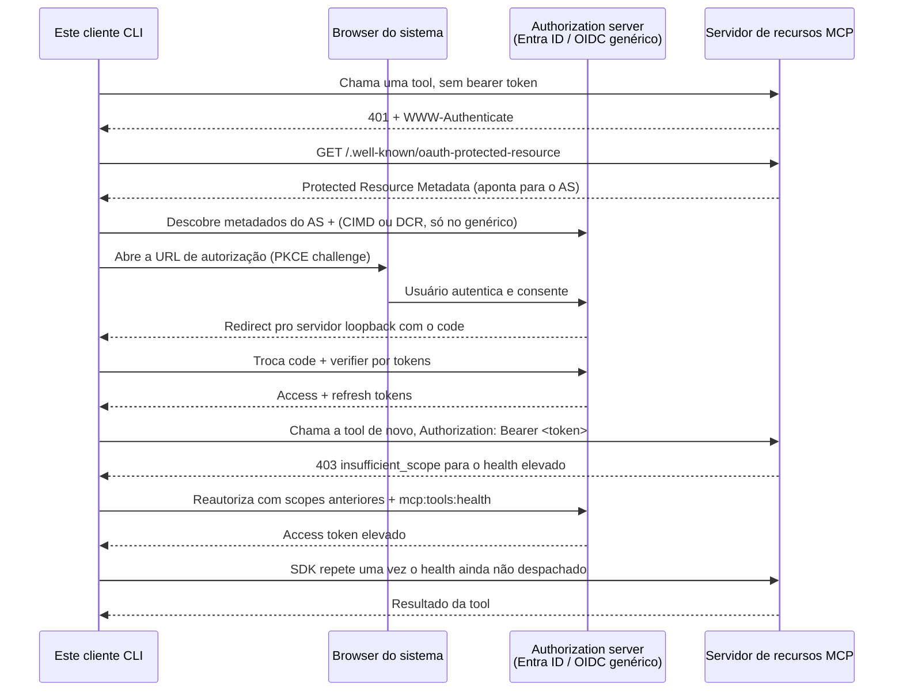

# mcp-client-auth-template

[](https://github.com/brunovicco/mcp-client-auth-template/actions/workflows/quality.yml)
[](https://github.com/brunovicco/mcp-client-auth-template/actions/workflows/compatibility.yml)
[](https://github.com/brunovicco/mcp-client-auth-template/actions/workflows/e2e.yml)
[](https://github.com/brunovicco/mcp-client-auth-template/releases)

[](LICENSE)

*[Read in English](README.md)*

Um template reutilizável de cliente MCP interativo nativo/CLI ou serviço não interativo que
autentica contra um authorization server OAuth 2.1 - Microsoft Entra ID ou qualquer authorization
server OIDC compatível com o padrão
(Auth0, Keycloak, WorkOS AuthKit, ...) - e então chama tools num servidor MCP. Alvo: especificação
MCP **2026-07-28**. Este é a metade cliente do padrão em
[`mcp-server-auth-template`](https://github.com/brunovicco/mcp-server-auth-template); os dois são
feitos pra rodar um contra o outro, mas cada um também se sustenta sozinho como ponto de partida.

Os providers OAuth do MCP Python SDK oficial tratam descoberta de Protected Resource Metadata
e do authorization server, PKCE, refresh de token, validação de issuer RFC 9207, credenciais
vinculadas ao issuer, Client ID Metadata Documents quando anunciados e fallback para Dynamic
Client Registration onde suportado. O MCP `2026-07-28` deprecia DCR em favor de Client ID Metadata
Documents para novas integrações. O modo Entra, portanto, usa um cliente público pré-registrado.
Este template fornece as peças que a aplicação precisa embutir - armazenamento de token, abertura
do browser, recebimento do redirect e o adapter de pré-registro do Entra - sem redescobrir essas
fronteiras de segurança em cada cliente. O template também expõe a extensão draft OAuth Client
Credentials para um cliente confidencial OIDC genérico pré-registrado, sem browser, CIMD ou DCR.
Veja `docs/adr/0002-oauth21-native-client.md` e a ADR-0018 para o raciocínio completo.

## Compatibilidade

A release `v0.2.0` suporta Python **3.13 e 3.14**, MCP Python SDK **2.x**
(`>=2.0,<3`) e o perfil de referência MCP **2026-07-28**. O CI exercita continuamente o piso do
SDK (`2.0.0`) e o 2.x compatível mais recente, os dois providers de autenticação, HTTPS de
produção, perfis locais IPv4/IPv6 explicitamente habilitados e E2Es OAuth/MCP reais para CIMD-first
e fallback DCR contra o servidor companheiro. A mesma suíte cobre client credentials OIDC genérico.

Veja [`docs/COMPATIBILITY.md`](docs/COMPATIBILITY.md) para a política executável de suporte e seu
escopo. Interoperabilidade ao vivo com IdPs específicos não é reivindicada pela matriz local
determinística.

## Início rápido (auth)

1. Copie `.env.example` para `.env` e preencha um dos dois blocos de provider (Entra ID ou um
   authorization server OIDC genérico), e aponte `MCP_CLIENT_SERVER_URL` para uma instância
   rodando do template de servidor.
2. Rode a demo:

   ```bash
   uv run python -m mcp_client_auth_template.entrypoints.demo_client
   ```
3. Com `MCP_CLIENT_AUTH_MODE=interactive` (o padrão), a primeira execução abre seu browser pro
   fluxo de authorization code + PKCE, espera num
   listener loopback local (`http://127.0.0.1:8765/callback` por padrão) pelo redirect, troca o
   code por tokens, e chama as tools `whoami` e `health` do servidor.
4. Com `MCP_CLIENT_TOKEN_STORAGE_PATH` configurado (o padrão,
   `~/.mcp-client-auth-template/tokens.json`), execuções seguintes reusam e renovam o token
   silenciosamente em vez de pedir autenticação de novo. Deixe vazio pra usar armazenamento
   apenas em memória.

Alterne `MCP_CLIENT_AUTH_PROVIDER` entre `entra` e `generic` para trocar de adapter - nenhuma
outra mudança de código é necessária. Veja `src/mcp_client_auth_template/adapters/` para as duas
factories de provider e `tests/unit/test_*_client_auth.py` para como cada uma é testada offline
(um token store fake em memória, sem rede, sem IdP real).

Para jobs sem usuário, use `MCP_CLIENT_AUTH_MODE=client_credentials` com provider `generic`,
configure o `MCP_CLIENT_CLIENT_CREDENTIALS_CLIENT_ID` pré-registrado e injete
`MCP_CLIENT_CLIENT_CREDENTIALS_SECRET` por um secret manager no início do processo. Esse perfil usa
`ClientCredentialsOAuthProvider` com `client_secret_basic`, anuncia
`io.modelcontextprotocol/oauth-client-credentials`, não inicia browser/listener e mantém access
tokens somente em memória. O perfil determinístico não reivindica interoperabilidade de client
credentials com Entra: o contrato `{resource}/.default` e app roles do Entra é separado.

## Fluxo de autenticação

A troca interativa completa de authorization code + PKCE que este cliente conduz, de ponta a ponta:



Veja `docs/ARCHITECTURE.md` para a divisão completa de camadas e as decisões transversais por trás
desse fluxo.

## Desenvolvimento

```bash
uv lock --check
uv sync --frozen --all-groups
uv run pytest
uv run python scripts/quality_gate.py
```

Liste ou selecione checks do gate com `--list` e `--check NAME`. Veja `AGENTS.md` para os
requisitos de build, lint, format, typecheck, test, security, architecture, MCP e conclusão, e
`docs/DEVELOPMENT.md` para o build do container e o setup local.

O Codex carrega o `.codex/config.toml`, `.codex/hooks.json` e `.agents/skills/` já versionados
apenas dentro do contexto de projeto/confiança apropriado. Revise os hooks de lifecycle com
`/hooks` antes de usar.

## Licença

[MIT](LICENSE)
