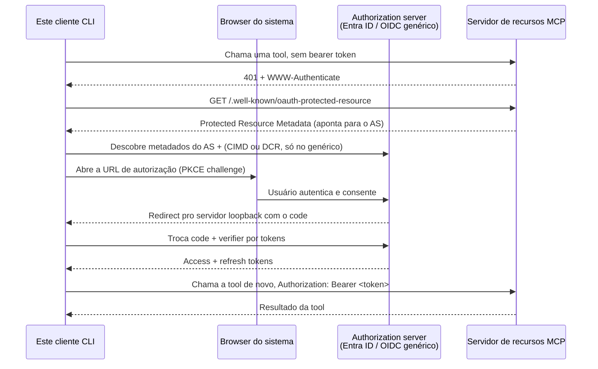

# mcp-client-auth-template

[](https://github.com/brunovicco/mcp-client-auth-template/actions/workflows/quality.yml)

[](LICENSE)

*[Read in English](README.md)*

Um template reutilizável de cliente MCP nativo/CLI que autentica contra um authorization server
OAuth 2.1 - Microsoft Entra ID ou qualquer authorization server OIDC compatível com o padrão
(Auth0, Keycloak, WorkOS AuthKit, ...) - e então chama tools num servidor MCP. Alvo: especificação
MCP **2026-07-28**. Este é a metade cliente do padrão em
[`mcp-server-auth-template`](https://github.com/brunovicco/mcp-server-auth-template); os dois são
feitos pra rodar um contra o outro, mas cada um também se sustenta sozinho como ponto de partida.

O `OAuthClientProvider` do SDK oficial já implementa descoberta de PRM, descoberta de metadados do
AS, PKCE, registro de client CIMD-first com fallback automático pra Dynamic Client Registration,
refresh de token e validação de issuer (RFC 9207). O Entra ID também não pode ser registrado
dinamicamente (sem DCR, sem CIMD), então uma integração real precisa de um client pré-registrado de
qualquer forma. Este template fornece exatamente as peças que o SDK espera que a aplicação
forneça - armazenamento de token, abertura de browser e recebimento do redirect - construídas uma
vez, corretamente, pra que um novo cliente MCP não precise redescobrir um servidor loopback RFC
8252 ou o tratamento de pré-registro do Entra do zero. Veja `docs/adr/0002-oauth21-native-client.md`
para o raciocínio completo.

## Início rápido (auth)

1. Copie `.env.example` para `.env` e preencha um dos dois blocos de provider (Entra ID ou um
   authorization server OIDC genérico), e aponte `MCP_CLIENT_SERVER_URL` para uma instância
   rodando do template de servidor.
2. Rode a demo:

   ```bash
   uv run python -m mcp_client_auth_template.entrypoints.demo_client
   ```
3. A primeira execução abre seu browser pro fluxo de authorization code + PKCE, espera num
   listener loopback local (`http://127.0.0.1:8765/callback` por padrão) pelo redirect, troca o
   code por tokens, e chama as tools `whoami` e `health` do servidor.
4. Com `MCP_CLIENT_TOKEN_STORAGE_PATH` configurado (o padrão,
   `~/.mcp-client-auth-template/tokens.json`), execuções seguintes reusam e renovam o token
   silenciosamente em vez de pedir autenticação de novo. Deixe vazio pra usar armazenamento
   apenas em memória.

Alterne `MCP_CLIENT_AUTH_PROVIDER` entre `entra` e `generic` para trocar de adapter - nenhuma
outra mudança de código é necessária. Veja `src/mcp_client_auth_template/adapters/` para as duas
factories de provider e `tests/unit/test_*_client_auth.py` para como cada uma é testada offline
(um token store fake em memória, sem rede, sem IdP real).

## Fluxo de autenticação

A troca completa de authorization code + PKCE que este cliente conduz, de ponta a ponta:



Veja `docs/ARCHITECTURE.md` para a divisão completa de camadas e as decisões transversais por trás
desse fluxo.

## Desenvolvimento

```bash
uv lock --check
uv sync --frozen --all-groups --extra observability
uv run pytest
uv run python scripts/quality_gate.py
```

Liste ou selecione checks do gate com `--list` e `--check NAME`. Veja `AGENTS.md` para os
requisitos de build, lint, format, typecheck, test, security, architecture, MCP e conclusão, e
`docs/DEVELOPMENT.md` para o build do container e o setup local.

O Codex carrega o `.codex/config.toml`, `.codex/hooks.json` e `.agents/skills/` já versionados
apenas dentro do contexto de projeto/confiança apropriado. Revise os hooks de lifecycle com
`/hooks` antes de usar.

## Licença

[MIT](LICENSE)
