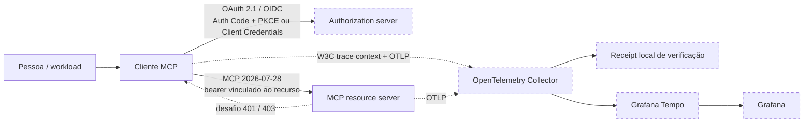

# mcp-client-auth-template

[](https://github.com/brunovicco/mcp-client-auth-template/actions/workflows/quality.yml)
[](https://github.com/brunovicco/mcp-client-auth-template/actions/workflows/reference-demos.yml)
[](https://github.com/brunovicco/mcp-client-auth-template/releases)

[](LICENSE)

*[Read in English](README.md)*

> Uma implementação de referência de autenticação para clientes MCP remotos, pensada para
> produção: OAuth 2.1/OIDC, Authorization Code + PKCE, Client Credentials, discovery CIMD-first,
> step-up controlado de scopes, resource binding exato, MCP stateless `2026-07-28` e evidência
> ponta a ponta com OpenTelemetry.

Use este repositório quando a dificuldade não é apenas "como chamar um servidor MCP?", mas **como
fazer isso sem enfraquecer as fronteiras de identidade, token, transporte e observabilidade**. Ele
forma um par com
[`mcp-server-auth-template`](https://github.com/brunovicco/mcp-server-auth-template) e inclui demos
executáveis que não dependem de credenciais de produção ou IdP real.

## O que este repositório prova

O caminho de referência valida comportamento real, não apenas configuração:

- ✅ OAuth interativo CIMD-first com Authorization Code + PKCE
- ✅ Protected Resource Metadata RFC 9728 e resource binding RFC 8707
- ✅ validação de issuer da resposta de autorização conforme RFC 9207
- ✅ step-up limitado de `403 insufficient_scope`, sem ampliar grants silenciosamente
- ✅ tools protegidas ocultas do discovery anônimo
- ✅ JWT com audience incorreta rejeitado com `401`
- ✅ transporte MCP stateless `2026-07-28`, sem estado de `Mcp-Session-Id`
- ✅ perfil opcional de Client Credentials para workloads OIDC sem usuário
- ✅ propagação W3C Trace Context entre cliente e servidor MCP
- ✅ o mesmo trace distribuído validado positivamente no Collector e no Tempo
- ✅ assertions de telemetria que excluem valores sensíveis de OAuth/MCP

## Arquitetura



O ambiente local de referência usa um servidor OIDC sintético e serviços locais de
observabilidade. A fronteira de produção continua agnóstica ao provider: Microsoft Entra ID ou um
authorization server OIDC compatível com padrões pode ser responsável pela emissão de tokens.

Veja [Arquitetura](docs/ARCHITECTURE.md) para a sequência completa e as responsabilidades de cada
componente.

## Demo em 5 minutos

O caminho mais rápido para avaliar o projeto é o cenário containerizado:

```bash
./scripts/run_compose_demo.sh
```

Ele executa o cliente contra o Server companheiro `v0.5.0` publicado por digest imutável, realiza
Authorization Code + PKCE CIMD-first, prova step-up de scope e tratamento de audience incorreta e
termina com um banner determinístico de sucesso/falha.

Para a prova observável completa:

```bash
./scripts/run_observability_demo.sh --keep
```

Uma execução bem-sucedida termina com:

```text
P1.7c OBSERVABILITY DEMO PASSED
Collector: positive OTLP receipt
Context:   MCP client/server share one trace_id
Tempo:     trace query succeeded
Grafana:   Tempo datasource provisioned
Privacy:   OAuth/MCP sensitive values absent
```

### Evidência visual


A execução observável produz um trace distribuído real com o root da referência e spans MCP do
cliente e do servidor:


## Demos de referência

| Demo | Comando | O que prova |
| --- | --- | --- |
| P1.7a — headless | `./scripts/run_reference_demo.sh` | Server real ao lado + OIDC sintético, OAuth interativo, step-up, audience incorreta e MCP stateless |
| P1.7b — Compose | `./scripts/run_compose_demo.sh` | Topologia reproduzível em containers usando o Server publicado por digest imutável |
| P1.7c — observável | `./scripts/run_observability_demo.sh` | Receipt no Collector, continuidade de trace client/server, recuperação no Tempo, provisionamento do Grafana e assertions de privacy |

O P1.7a aceita `--server-root PATH` quando o repositório companheiro não está clonado ao lado.

## Demo vs. produção

| Demo de referência | Adoção em produção |
| --- | --- |
| OIDC local sintético | IdP / authorization server corporativo com registro e consentimento revisados |
| Namespace compartilhado e loopback | Rede de serviços com TLS e ownership explícito de proxy |
| OpenTelemetry Collector local | Pipeline de telemetria gerenciado pela organização |
| Tempo local com flush/poll reduzidos | Retenção, batching, HA e storage dimensionados para produção |
| Grafana local anônimo | Grafana autenticado com menor privilégio |
| Identidades e chaves sintéticas | Credenciais via secret manager e controles específicos do provider |

As configurações locais são intencionalmente otimizadas para uma prova determinística e **não**
devem ser copiadas como defaults de produção.

## Modos de autenticação

| Modo | Providers | Ciclo de vida da credencial | Uso típico |
| --- | --- | --- | --- |
| `interactive` | Entra ID ou OIDC genérico | Browser + PKCE; arquivo opcional de refresh token | Ferramentas de desenvolvimento, apps nativos/desktop e CLIs de operador |
| `client_credentials` | Perfil determinístico OIDC genérico | Secret injetado no startup; access token fica em memória | CI, workers de backend e automações agendadas |

OIDC genérico interativo usa CIMD primeiro e DCR apenas como fallback de compatibilidade. Entra usa
cliente pré-registrado. O modo máquina não abre browser, não inicia callback loopback, não usa
CIMD/DCR e não persiste credencial ou access token.

## Propriedades de segurança

- Discovery OAuth e tráfego de token usam HTTPS por padrão e passam por controles de esquema,
  redirect, compressão, tamanho de resposta, destino, respostas DNS e rebinding.
- Bearer credentials são enviados apenas para a fronteira exata do recurso MCP configurado.
- O callback loopback aceita endereços loopback literais, requisições limitadas, path exato e
  dados OAuth de state/issuer validados.
- Arquivos POSIX de token exigem ownership/permissões privadas, rejeitam symlinks/hardlinks,
  limitam leitura e usam substituição atômica durável. Há opção em memória.
- Client secrets usam `SecretStr`, permanecem em memória e são excluídos de falhas estruturadas.
- Logs e traces excluem credenciais, authorization codes, payloads MCP, bodies, headers/URLs
  arbitrários, baggage, dados pessoais e texto de exceções.
- GitHub Actions são pinadas por SHA e usam permissões read-only por padrão; escritas de release
  ficam isoladas em jobs de menor privilégio.

O storage persistente de tokens interativos é intencionalmente plaintext. Controles de filesystem
reduzem exposição local, mas não substituem keyring do sistema operacional ou secrets manager.
Leia [Privacidade e tratamento de dados](docs/PRIVACY.md).

## MCP `2026-07-28`

Os templates de client/server exercitam o perfil moderno stateless como comportamento executável:

- `server/discover` seleciona o caminho moderno sem o handshake legado
  `initialize` / `initialized`;
- `_meta` por request carrega identidade/capacidades do cliente;
- requests modernos usam `MCP-Protocol-Version`, `Mcp-Method` e `Mcp-Name`;
- Protected Resource Metadata conduz o discovery do authorization server;
- `resource` percorre authorization/token requests e vincula a audience do JWT;
- `403 insufficient_scope` em runtime preserva grants existentes e faz um replay limitado;
- machine-to-machine é opt-in por `io.modelcontextprotocol/oauth-client-credentials`.

Veja [Compatibilidade](docs/COMPATIBILITY.md) e [E2E entre repositórios](docs/E2E.md).

## Início rápido

Pré-requisitos: Python 3.13 ou 3.14 e
[`uv`](https://docs.astral.sh/uv/getting-started/installation/).

```bash
git clone https://github.com/brunovicco/mcp-client-auth-template.git
cd mcp-client-auth-template
cp .env.example .env
uv sync --frozen --all-groups
uv run python -m mcp_client_auth_template.entrypoints.demo_client
```

Aponte `MCP_CLIENT_SERVER_URL` para seu MCP resource server e configure o bloco Entra ou OIDC
genérico no `.env`.

## Estrutura do repositório

```text
src/                    implementação do cliente
tests/                  evidências unitárias, de contrato e E2E
scripts/                quality gate, demos e automação de release
docs/                   arquitetura, operações e segurança
observability/          configuração de Collector, Tempo e Grafana para demo
.github/workflows/      CI, compatibilidade, demos e release
compose.reference-demo.yml
compose.observability.yml
```

Estado local de editor/agentes é intencionalmente excluído do repositório público.

## Testes e qualidade

```bash
uv lock --check
uv sync --frozen --all-groups
uv run pytest
uv run python scripts/quality_gate.py
```

O quality gate cobre lint, format, Mypy strict, arquitetura, testes/cobertura, Bandit,
auditoria de dependências, controles de supply chain, baseline de governança e validação do bundle
vendorizado de loop schemas.

As demos têm workflow próprio no GitHub Actions. P1.7a e P1.7b rodam em pull requests; P1.7c roda
em `main`, validação agendada e `workflow_dispatch`.

## Documentação

| Documento | Quando usar |
| --- | --- |
| [Arquitetura](docs/ARCHITECTURE.md) | Fronteiras, camadas e sequência de autorização |
| [Compatibilidade](docs/COMPATIBILITY.md) | Versões suportadas e contrato executável client/server |
| [Demo de referência](docs/REFERENCE_DEMO.pt-BR.md) | Prova headless P1.7a |
| [Demo Compose](docs/COMPOSE_DEMO.pt-BR.md) | Prova containerizada P1.7b |
| [Demo observável](docs/OBSERVABILITY_DEMO.pt-BR.md) | Prova P1.7c com Collector/Tempo/Grafana |
| [E2E entre repositórios](docs/E2E.md) | Matriz OAuth/MCP positiva e fail-closed |
| [Operações](docs/OPERATIONS.md) | Preflight, timeouts, shutdown e categorias de falha |
| [Privacidade](docs/PRIVACY.md) | Inventário de tokens, storage, retenção e tratamento de dados |
| [Supply chain](docs/SUPPLY_CHAIN.pt-BR.md) | Fronteira de confiança do CI, dependências e evidência de release |
| [Desenvolvimento](docs/DEVELOPMENT.md) | Setup local, checks e containers |
| [Decisões de arquitetura](docs/adr/) | Justificativas e trade-offs das decisões materiais |

## Servidor companheiro

O par de referência é:

- client: [`brunovicco/mcp-client-auth-template`](https://github.com/brunovicco/mcp-client-auth-template)
- server: [`brunovicco/mcp-server-auth-template`](https://github.com/brunovicco/mcp-server-auth-template)

As demos usam somente identidade local sintética; o CI normal não precisa de secret de produção ou
IdP real.

## Escopo

Este repositório é um template de referência, não um cliente OAuth hospedado. Um produto concreto
ainda precisa definir registro de redirects, política de consentimento, entrega segura de secrets,
storage de token para produção, ownership de TLS/proxy, tratamento de erros ao usuário,
monitoramento e validação real com o IdP.

## Licença

[MIT](LICENSE)
