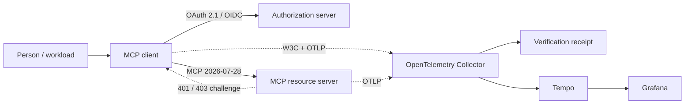
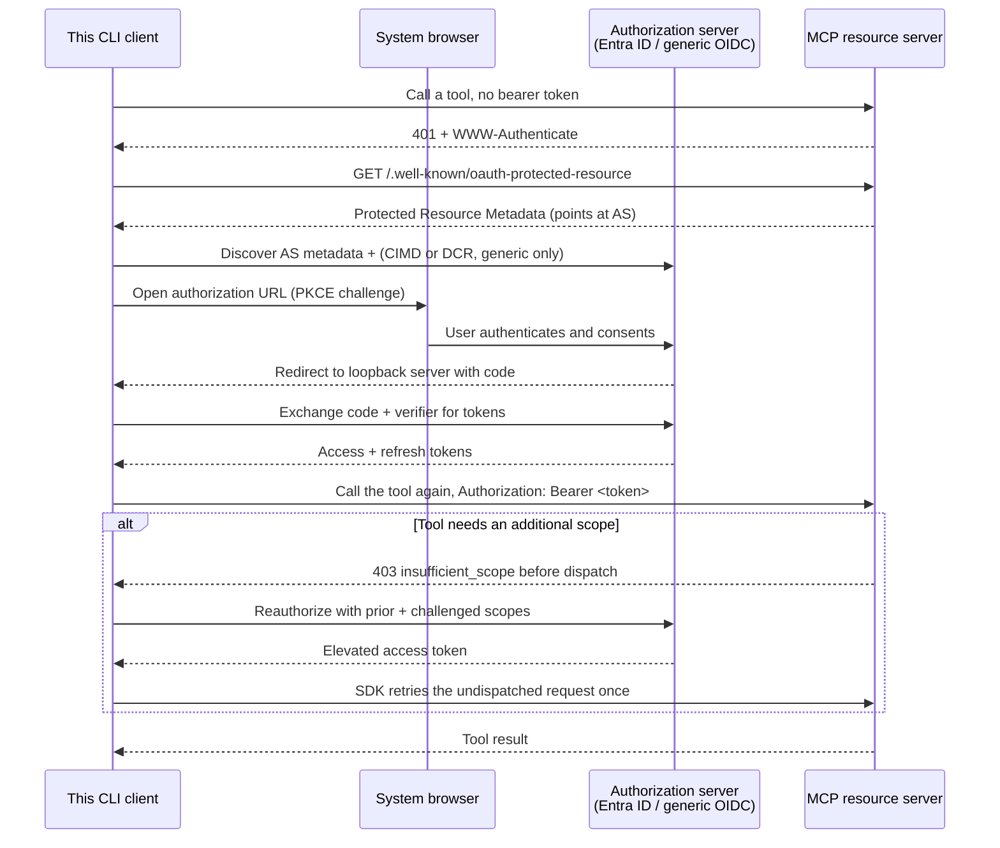

# Architecture

## Context

This service is a reusable template for an interactive native or non-interactive service MCP
client: it authenticates against an OAuth 2.1 authorization server and then talks to an MCP resource
server over the streamable-HTTP transport. See `docs/adr/0002-oauth21-native-client.md` for
why token issuance, discovery, PKCE, and registration are the SDK's responsibility, not this
repository's.

- **Upstream dependency**: exactly one authorization server per run - either Microsoft Entra
  ID (a pre-registered client, since Entra supports neither DCR nor CIMD) or any
  standards-compliant OIDC authorization server (Auth0, Keycloak, WorkOS AuthKit, ...),
  selected by `MCP_CLIENT_AUTH_PROVIDER`.
- **Downstream dependency**: one MCP resource server (2026-07-28 spec) at
  `MCP_CLIENT_SERVER_URL` - the companion repository,
  [`mcp-server-auth-template`](https://github.com/brunovicco/mcp-server-auth-template), is
  that server, and its `whoami`/`health` tools are what the demo entrypoint calls.
- **Local dependency**: interactive mode uses a loopback socket
  (`adapters/loopback_callback_server.py`) and may use a local JSON token file. Client-credentials
  mode uses neither: its fixed credential is injected at process start and access tokens remain in
  memory.

## Layers

This template is adapter-heavy by design: the SDK's `OAuthClientProvider` already owns the
OAuth 2.1 use case, so there is no application-layer port to define beyond the SDK's own
`TokenStorage` Protocol, which the adapters implement directly. `domain/` and `application/`
are kept as empty scaffolding for whichever business rules a concrete client built from this
template adds - the client flow itself lives entirely in `adapters/` (I/O the SDK asks the
embedding app to supply) and `entrypoints/` (wiring and the runnable demo).

```text
src/mcp_client_auth_template/
├── domain/
├── application/
├── adapters/
└── entrypoints/
```

### Domain

Pure business concepts, invariants, Value Objects, domain services, events, and domain errors.

### Application

Use cases, commands, queries, ports, authorization decisions, and transaction coordination.

### Adapters

Implementations of application ports for databases, messaging, HTTP, cache, storage, identity, and external SDKs.

### Entrypoints

HTTP, CLI, jobs, events, and serverless handlers. Entrypoints validate and translate transport data but do not own business rules.

## Dependency rule

```text
entrypoints -> application -> domain
adapters    -> application/domain
domain      -> no outer layer
```

## Cross-cutting decisions

- Configuration: environment variables validated at startup.
- Logging: structured events to stdout/stderr.
- Tracing: `a2a-otel-kit`'s `Observability` facade exports trace data over OTLP HTTP/protobuf only
  when `A2A_OTEL_ENABLED=true` is configured. It propagates W3C Trace Context, but not baggage,
  through a native MCP SDK 2.x/HTTPX2 transport adapter, and
  `entrypoints/demo_client.py::run_demo()` owns its lifecycle at the composition-root boundary.
  See `docs/OBSERVABILITY.md` and `docs/adr/0019-native-mcp-v2-observability.md`.
- Errors: infrastructure errors translated at adapters; external errors mapped at entrypoints.
- Time: UTC internally with timezone-aware values.
- Money: `Decimal` wrapped in a domain Value Object.
- Idempotency: required for externally visible side effects.
- Packaging: containerized via the repo `Dockerfile` (multi-stage, uv-based); the runtime `CMD` is defined per project.

## Executable reference topology



P1.7a proves the local process path, P1.7b proves the container topology, and P1.7c adds positive
distributed-trace and privacy verification. The synthetic OIDC provider and local observability
services are demo infrastructure, not production defaults.

## Authorization sequence

Interactive native-client authorization flow (one of the critical flows this service owns; the
authorization server's own login/consent UI is out of scope):



The non-interactive generic-OIDC path follows the same PRM and authorization-server discovery, but
uses a pre-registered client ID plus `client_secret_basic` at the token endpoint. It declares the
draft `io.modelcontextprotocol/oauth-client-credentials` capability on every MCP request, performs
no redirect/CIMD/DCR, and lets the SDK reacquire a token with the prior-plus-challenged scope union
after a pre-dispatch 403. Generic tokens retain their verified `client_id`/`subject`, but are not
promoted to Entra-style application principals or app roles.
